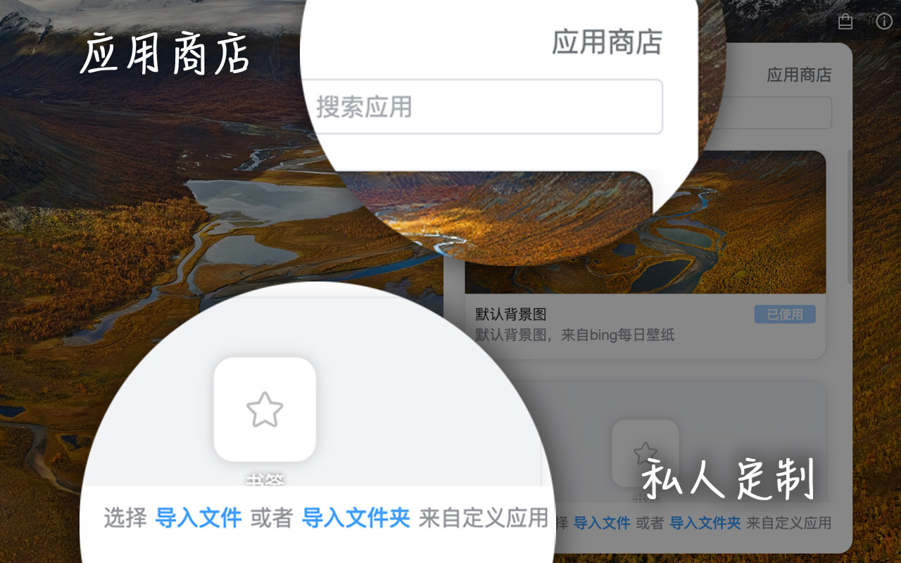

# flextab 浏览器插件应用仓库

这个仓库是 [flextab](https://chrome.google.com/webstore/detail/bmlnmklpjkgebkanggkomefmmfdfmode?authuser=0&hl=zh-CN) 浏览器插件的小组件仓库

# 如何创建一个 flextab 应用

接下来，我会介绍如何开发一个 flextab 应用

## widget.json

这个是每个应用必要的描述文件，主要定义了应用名称/应用备注/应用入口和应用大小等信息。

| 字段            | 描述                                                                                                                                 | 是否必填 |
| --------------- | ------------------------------------------------------------------------------------------------------------------------------------ | -------- |
| version         | 应用版本号                                                                                                                           | 是       |
| manifestVersion | 描述信息版本号，目前固定为 1                                                                                                         | 是       |
| type            | 代码模式，目前仅支持 vue3-sfc(vue3 单文件组件)                                                                                       | 是       |
| title           | 应用名称                                                                                                                             | 是       |
| description     | 描述信息                                                                                                                             |          |
| feature         | 应用用途，目前支持三种应用 card 表示插件用于信息卡片在用户网格桌面中展示，background 表示插件用于页面背景图展示，search 表示搜索插件 | 是       |
| mainView        | 插件主入口                                                                                                                           | 是       |
| detailView      | 详情入口，配置后，点击右键会出现详情按钮                                                                                             |          |
| editView        | 编辑入口，配置后，点击右键会出现编辑按钮                                                                                             |          |
| size            | 尺寸，类型 { width: number, height: number }，填写数字表示占 1 格宽 1 格高，默认是 1\*1                                              |          |

## 开始写应用

编写应用推荐使用最新的 chrome 浏览器

将本仓库克隆到本地，在仓库根目录下新建一个文件夹，名称自定，尽量唯一定好之后尽量不要改动了。

然后开始填写 widget.json，然后可以先创建一个简单的 mainView。

接着打开 [flextab](https://chrome.google.com/webstore/detail/bmlnmklpjkgebkanggkomefmmfdfmode?authuser=0&hl=zh-CN) 插件，打开新标签页，推荐开发时最好备份好自己的数据，以防开发时数据丢失。

打开新标签页之后，点击页面右上角，打开应用商店

点击最下方的导入文件夹，选择刚刚创建的文件夹，就可以继续完善页面内容了，每次修改，新标签页都会自动加载本地文件，不用刷新页面，如果刷新页面则需要再次打开应用商店导入文件夹。

## 发布自己的应用

编写好应用后，向本仓库提交 PullRequests，代码合并后，其他人也就可以使用你的应用装饰自己的新标签页了！🎉
